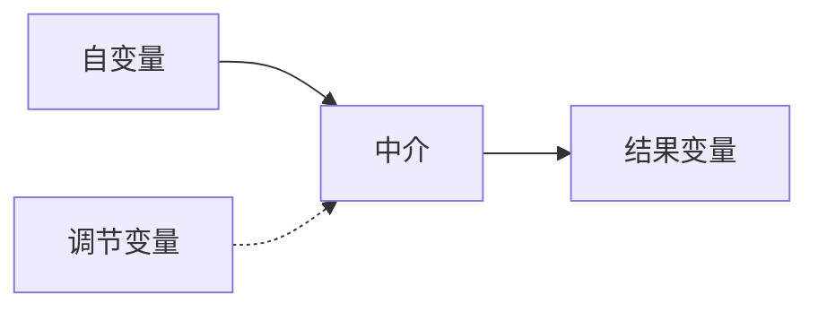

# 完整理论模型包

## 变量角色与构念边界

| 变量 | 角色 | 定义 | 不包含什么 | 建议测量 | 证据等级 |
|---|---|---|---|---|---|

## 路径—理论—证据矩阵

| 路径 | 理论 | 理论机制 | 适用边界 | 竞争解释 | 支持文献 | 证据等级 |
|---|---|---|---|---|---|---|

## 可检验假设与命题

## 方法对应

- PLS-SEM：理论路径、测量、中介与调节。
- ANN：样本外非线性预测，不将权重解释为因果。
- fsQCA：多重等效、必要/充分性与因果非对称。

## Mermaid概念模型

