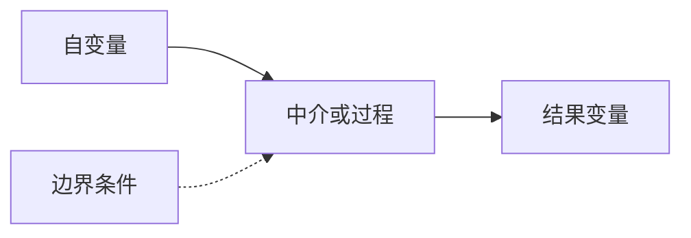

# 完整理论模型与研究设计包

## 经审计的核心缺口

| Gap ID | 等级 | 当前解释 | 失效位置 | 知识后果 | 证据等级 |
|---|---|---|---|---|---|

## 变量角色与构念边界

| 变量 | 角色 | 定义 | 不包含什么 | 建议测量 | 证据等级 |
|---|---|---|---|---|---|

## 路径—理论—证据矩阵

| 路径 | 理论 | 理论机制 | 适用边界 | 竞争解释 | 支持文献 | 证据等级 |
|---|---|---|---|---|---|---|

## 可检验假设、命题与区分性预测

## 研究问题—设计—方法匹配

| 研究问题 | 推断目标/estimand | 首选设计 | 数据要求 | 主要方法 | 替代/稳健性方法 | 识别假设 | 不能回答什么 |
|---|---|---|---|---|---|---|---|

> 从`assets/method_catalog.json`按问题和数据条件选择，不预填固定方法组合。用户指定方法必须经过适配审查。

## Mermaid概念模型

